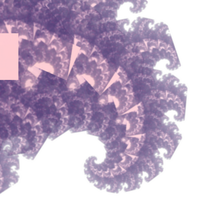
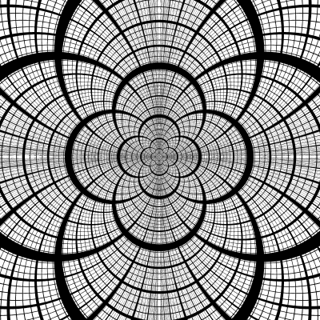
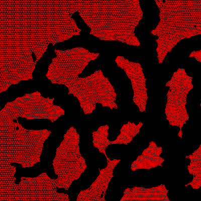

#Home

---
---

#All My Github Projects.
(many more yet to load)

---

##[Feedback](http://david-hagar.github.io/Fractal-Feedback/) - fractal feedback in WebGL 
[Run](http://david-hagar.github.io/Fractal-Feedback/) [Github](https://github.com/david-hagar/Fractal-Feedback)

 

   

---
 

##[Circles](https://github.com/david-hagar/Apollonian-Circles) - draws this static image at high resolution.

  

[Larger version](https://raw.github.com/david-hagar/Apollonian-Circles/master/circles-screens/screen0.png)
   

---
 

##[Cracks](https://github.com/david-hagar/Cracks) - simulates a cracking surface.

  

 

---
