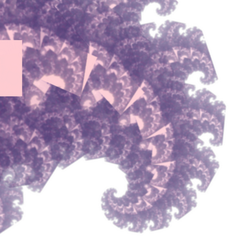
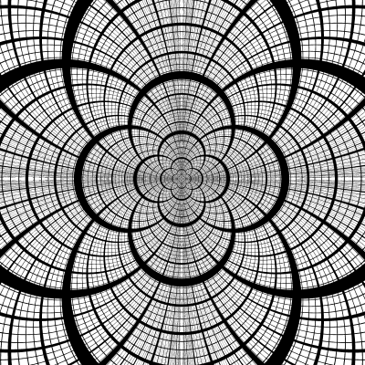
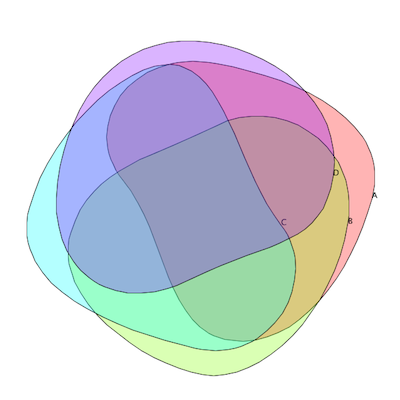
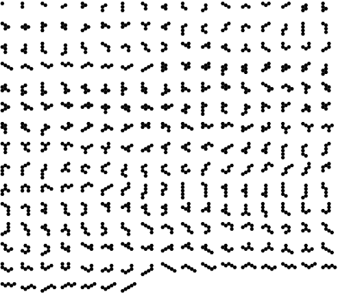
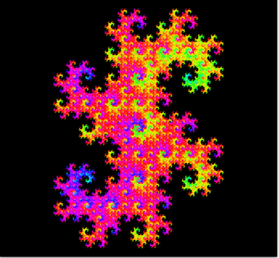
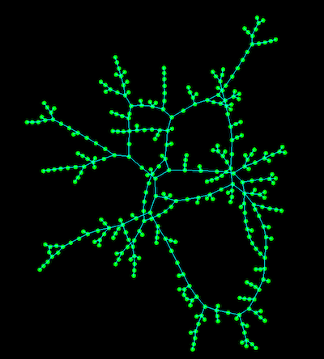
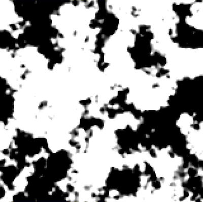
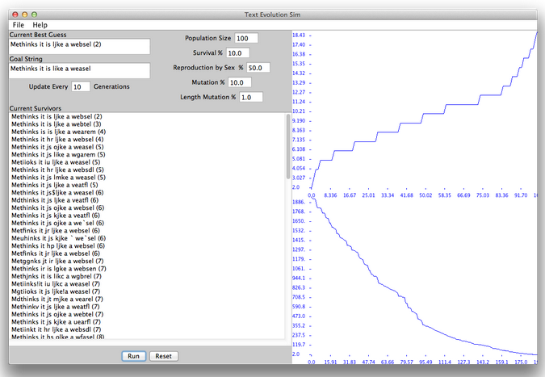
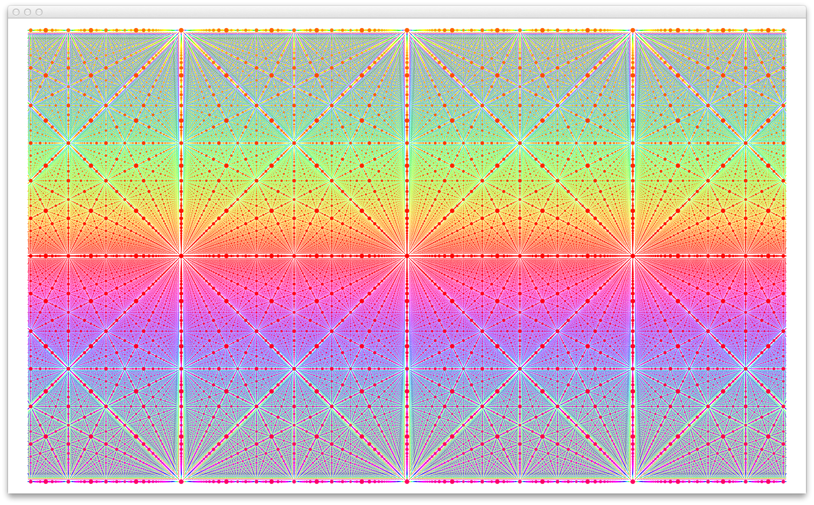

---
---

#All My Github Projects.
(many more yet to load)

---

##[Feedback](http://david-hagar.github.io/Fractal-Feedback/) - fractal feedback in WebGL 
[Run](http://david-hagar.github.io/Fractal-Feedback/) [Github](https://github.com/david-hagar/Fractal-Feedback)

 

   

---
 
##[Circles](https://github.com/david-hagar/Apollonian-Circles) - draws this static image at high resolution.
  

[Larger version](https://raw.github.com/david-hagar/Apollonian-Circles/master/circles-screens/screen0.png)
   

---
 
##[Cracks](https://github.com/david-hagar/Cracks) - simulates a cracking surface.
  

 

---

 
##[Venn Diagram Layout](https://github.com/david-hagar/Venn-Layout) - uses a genetic algorithm to try to create an ideal Venn diagram with correct areas.

---

 
##[Hex Grid Permute](https://github.com/david-hagar/Hex-Grid-Permute) - creates permutations of adjacent hexagons
 

 

---

 
##[Fractal Shape Maker](https://github.com/david-hagar/Fractal-Shape-Maker) - create recursive fractals from some shapes
 

 
 

---

 
##[Graph Placement](https://github.com/david-hagar/Graph-Placement) - lays out an arbitrary graph
 

 
 

---

 
##[Grid Fractals](https://github.com/david-hagar/Grid-Fractals) - random fractal texture generator
 

 
 
---

 
## [Evolving Text](https://github.com/david-hagar/Evolving-Text) - guesses a arbitrary string
 

 
 
---

 

## [Cube Dots](https://github.com/david-hagar/CubeDots) - Renders alignment patterns in a 3D grid of dots

 

 
 
 
 
 
 

